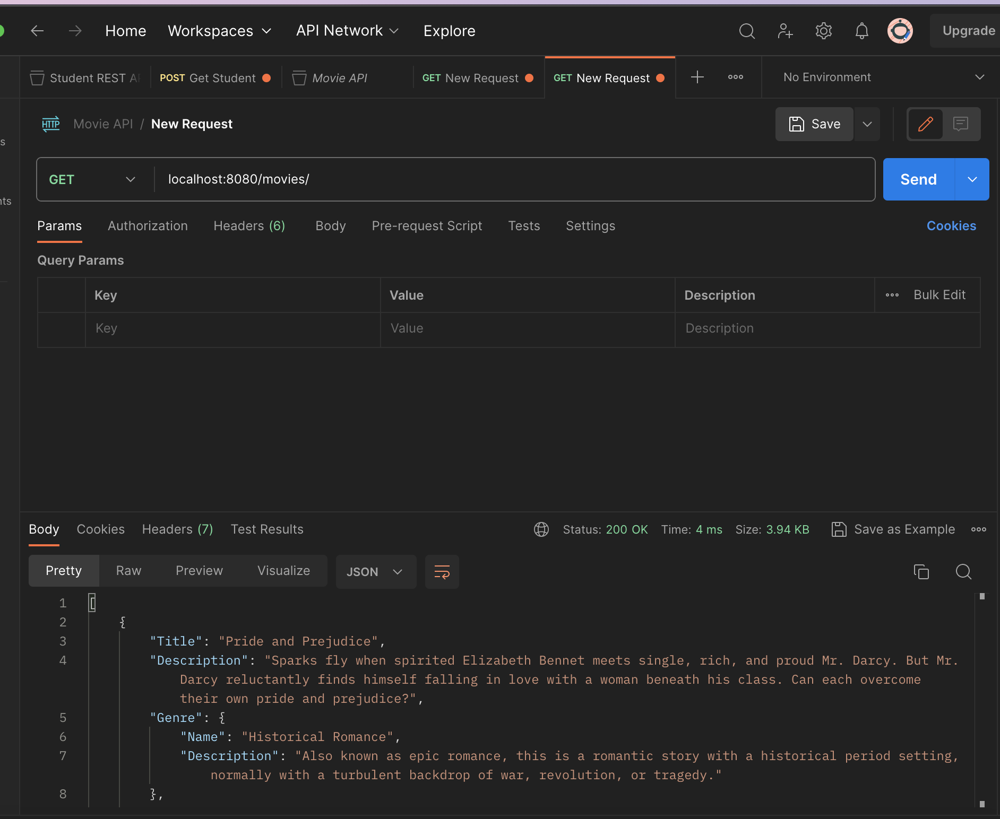
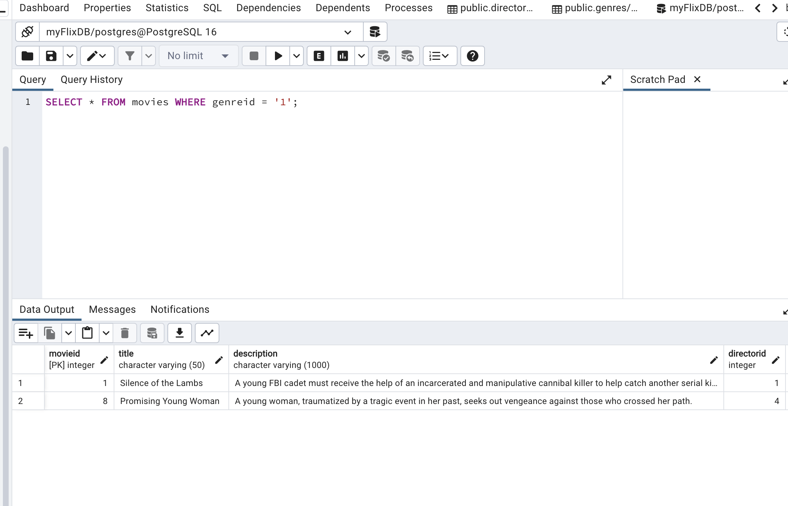
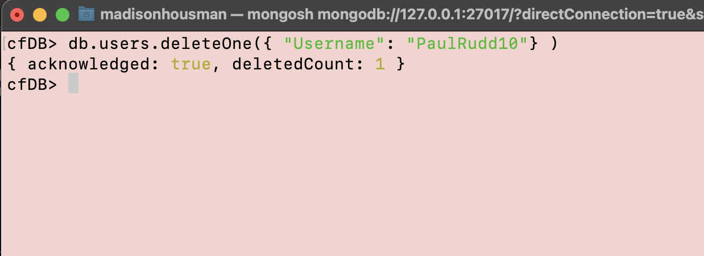

# Server-side API 

### myFlix API  will provide users with access to information about different movies, directors, and genres. Users will be able to sign up, update their personal information, and create a list of their favorite movies.

## Screenshot 
### Postman - return a list of all movies

### PgAdmin - return a list of all movies in a genre

### Mongosh - delete user

Features: 
- Return a list of ALL movies to the user
- Return data (description, genre, director, image URL, whether it’s featured or not) about a
single movie by title to the user
- Return data about a genre (description) by name/title (e.g., “Thriller”)
- Return data about a director (bio, birth year, death year) by name
- Allow new users to register
- Allow users to update their user info (username, password, email, date of birth)
- Allow users to add a movie to their list of favorites
- Allow users to see which actors star in which movies
- Allow users to remove a movie from their list of favorites
- Allow existing users to deregister

Technology used:
- Node.Js & Express
- Rest architecture
- Middleware modules such as body parsor, etc.
- MongoDB
- & more listed in package.json file

Documentation for the app and its endpoints are found in the documentation.html file within the public folder.
